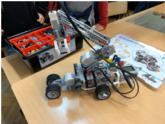

# hibakereses
Közös hibakeresés

## Most tanulunk mindent

 - A Git használatát
 - A diákokkal a hibakeresést
 - Az OOP alapfogalmait
 - Én pedig most a Markdown használatát
 
## Hogyan kezdődött a projekt?

Az ITMP klubnak és a Green Fox Academy-nek köszönhetően részt vehettünk a "Technológia és módszertan a projektalapú informatika oktatáshoz" címet viselő 2 alkalmas képzésen. 
A képzés keretében olyan eszközökkel ismerkedhettünk meg, amik ma már nélkülözhetetlenek a csapatban végzett, projektalapú IT tevékenységeknél. S hogy mindezt a gyakorlatban is megtapasztalhassuk, egy projekt megvalósítását kapták a csapatok feladatként.

## Projekt a workshop alatt

A projekt alatt 4 fős csapatban egy repüléssel kapcsolatos statisztikai web-oldalt kellett létrehoznunk.

A feladathoz szükséges készségek a csapatban (a csapat-munka eszközökön felül):

 - HTML és CSS fejlesztés
 - JavaScript fejlesztés
 - Képek méretezése és vágása
 - Ikonok színezése
 - Adat elemzés CSV file-okból
 - File olvasás és manipulálás szabadon választott programozói környezetben
 - Képek gyűjtése internetről
 - Dokumentáció készítése 

### Ez egy alcím (h3)
Ez az ITMP klub elérhetősége: <https://itmp.hu/>

Így néz ki az én önéletrajzom: <https://bkata64.github.io>

De így is írhatom: [Önéletrajz](https://bkata64.github.io)

### Mi hiányzik még?

 1. `Táblázat`
 2. `Meg nem tudom`
 
No nézzünk akkor egy táblázatot:

 | Első oszlop | Második oszlop |
 | ----------- | -------------- |
 | Valami | Semmi |
 | Akármi | Bármi |

